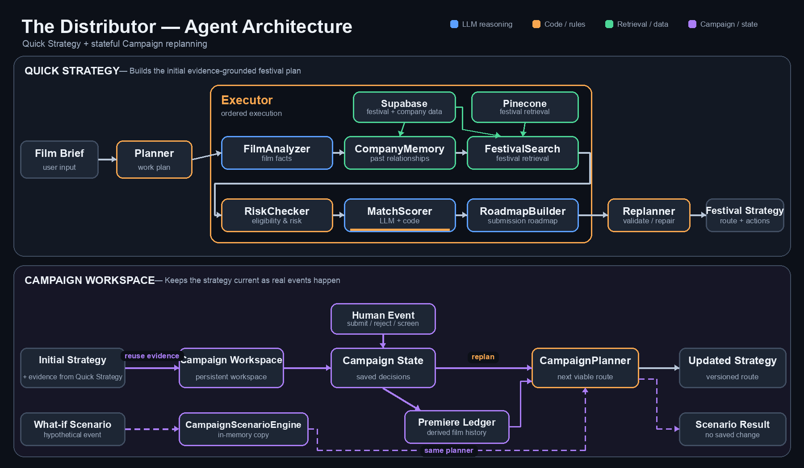

# The Distributor

The Distributor is a film-festival strategy agent for independent distributors. It turns a
film brief into a grounded submission plan, then lets a distributor keep that plan current
as submissions, screenings, and outcomes change.

We built it around a simple rule: language models interpret film and festival context, while
code owns facts, arithmetic, state transitions, and validation.

## Live Demo

- **Production:** [the-distributor-deploy.vercel.app](https://the-distributor-deploy.vercel.app/)
- **GitHub:** [Yosef-Goldschmidt/the-distributor](https://github.com/Yosef-Goldschmidt/the-distributor)
- **Submission branch:** `main`

## The Problem

Choosing film festivals is not just a ranking problem. A distributor has to balance creative
fit, deadlines, fees, past relationships, programming priorities, and premiere rules. Those
choices are connected: a public screening that helps one route can make another route
ineligible, and a rejection can change which remaining sequence makes sense.

The information is also uneven. Some facts come from structured records, some from the
distributor's history, and some festival rules are incomplete or need to be checked again.
A useful tool therefore has to recommend a route without presenting uncertainty as fact.

## What the Agent Does

The user supplies a free-text film brief with details such as format, genre, themes, country,
director background, runtime, premiere history, and availability. The agent then:

1. extracts only the film facts supported by the brief;
2. retrieves relevant festivals and the distributor's relationship history;
3. checks deadlines, accepted formats, and premiere risk;
4. scores the grounded candidates;
5. produces a primary submission route, alternatives, actions, risks, and questions that
   still require verification; and
6. returns an ordered execution trace showing how the result was assembled.

The score is a decision aid, not an acceptance probability. Each recommendation keeps its
source or submission link, deadline confidence, and the evidence behind its placement.

## Two Ways to Use It

### Quick Strategy (`/`)

Quick Strategy is the required course interface and the fastest way to use the system. Paste
one film brief and receive a one-shot roadmap with a human-readable festival summary,
recommendation buckets, deadlines, confidence, reasons, actions, and risks. Technical
provenance and the complete execution trace remain available in a collapsed disclosure, so
the main reading path stays focused on the decision.

### Campaign Workspace (`/campaign`)

Campaign Workspace is additive; it does not replace Quick Strategy. It creates a private,
persistent workspace for a film and tracks the campaign over time. The distributor records
real events through explicit controls, and the system versions the strategy after each valid
change.

For example, if Festival A is the active primary and the distributor records a rejection,
the event is added to the campaign history, Festival A is excluded from the active route,
and the planner recomputes the best route from the remaining evidence. Festival B may become
the new primary, and the workspace explains what changed between the two strategy versions.
When the existing evidence is still valid, this operational replan requires zero chat calls
and zero embedding requests.

The same workspace can test one to three hypothetical events, such as a public screening,
on an in-memory copy. The result is clearly marked as a scenario and never changes the real
campaign.

## Agent Architecture



The Quick Strategy execution order is:

```text
Film brief
  -> Planner
  -> Executor
  -> FilmAnalyzer
  -> CompanyMemory
  -> FestivalSearch
  -> RiskChecker
  -> MatchScorer
  -> RoadmapBuilder
  -> Replanner
  -> Final strategy
```

| Module | Responsibility |
| --- | --- |
| `Planner` | Deterministically declares the required work so a domain step cannot be omitted. |
| `Executor` | Runs the evidence chain in dependency order and records the trace. |
| `FilmAnalyzer` | Extracts supported film facts, premiere history, unknowns, and a retrieval query; deterministic adaptation normalizes the result. |
| `CompanyMemory` | Retrieves the distributor's recorded festival history and relationship strength. |
| `FestivalSearch` | Combines vector retrieval, local lexical search, company history, prestige reserves, structured festival facts, fallback provenance, and entity deduplication. |
| `RiskChecker` | Deterministically checks deadlines, format compatibility, and festival-side premiere eligibility with confidence labels. |
| `MatchScorer` | Uses an LLM for four qualitative fit ratings, then validates the structure and computes the final score in code. |
| `RoadmapBuilder` | Selects which supplied evidence and unresolved questions to foreground; deterministic code owns the final actions, narrative, sequence, and calendar. |
| `Replanner` | Deterministically validates the roadmap and permits one targeted roadmap correction when required. |

A normal Quick Strategy run makes three LLM chat calls: `FilmAnalyzer`, `MatchScorer`, and
`RoadmapBuilder`. When vector retrieval is configured, it also makes one query-embedding
request. A structural validation failure can trigger a narrowly scoped repair instead of
rerunning the whole pipeline.

## Why We Split the System This Way

LLMs are useful where the input is semantic: understanding a synopsis, comparing themes,
and explaining why a festival fits. They are less reliable for arithmetic, dates, state
machines, and enforcing contracts. We keep those parts deterministic so the same facts lead
to the same operational result.

Retrieval happens before scoring or roadmap writing. Later modules can select from supplied
evidence, but they cannot silently create a new festival fact. The final trace preserves the
source of recommendations and labels local or remote fallbacks accurately.

We also separate two questions that are easy to confuse:

- **What happened to the film?** Explicit screenings and online releases determine whether
  the film's premiere opportunity is available, consumed, or genuinely unknown.
- **What does a festival allow?** Each festival can be eligible, ineligible, or require rule
  verification based on the evidence available for that festival.

Uncertain festival rules never erase a confirmed film-history fact. If the brief explicitly
says there were no public screenings, that remains known downstream. If it reports a public
screening or unrestricted online release, the occurrence remains recorded even when a
festival's treatment of that event still needs verification.

Campaign replanning follows the same division of responsibility. It invalidates only the
artifacts affected by a change: film-identity changes refresh evidence, premiere events
refresh premiere risk and compatibility, and operational outcomes such as rejection reuse
the existing evidence and update the plan.

## Campaign Workspace Architecture

A campaign is a capability-scoped aggregate stored in Supabase. It contains the film facts,
human-recorded events, premiere ledger, candidate evidence, active strategy, and immutable
strategy history. A deterministic reducer is the only path for applying campaign commands.

The premiere ledger derives film-side state from the brief and recorded screening events.
A directed compatibility graph separately represents whether one festival screening can
follow another as compatible, incompatible, or requiring verification. The deterministic
`CampaignPlanner` consumes a frozen planning input, chooses one primary and up to two
alternatives, applies hard gates, and reports which options are preserved, lost, or still
uncertain.

Human events remain human-owned. The workspace can record submissions, rejections,
screenings, corrections, locks, and exclusions, but it does not submit to festivals or
invent outcomes. Each accepted command creates a new strategy version and a structured
summary of the change. The scenario engine uses the same event and planning logic on a
discarded clone, with no repository write.

## Scoring and Decision Logic

`MatchScorer` asks the LLM for four 0–5 qualitative ratings with short evidence phrases.
Company relationship and deadline urgency come from structured data, and code validates the
ratings before applying these weights:

| Dimension | Weight |
| --- | ---: |
| Thematic fit | 25 |
| Genre fit | 15 |
| Past lineup or winner similarity | 20 |
| Company relationship history | 15 |
| Strategic value | 15 |
| Deadline urgency | 10 |

Premiere risk is an explicit penalty rather than a seventh score component: high risk
subtracts 15 points and medium risk subtracts 7. The system also guards against unsupported
creative evidence and distinguishes an exact current deadline from a projected annual
cycle. The resulting buckets are **Submit First**, **Prioritize Next**, **Leverage**, and
**Hold / Avoid**.

## Evidence, Uncertainty, and Traceability

The system distinguishes structured facts, descriptive enrichment, company history, model
interpretation, and unresolved rules. Confidence labels stay attached to deadlines and
eligibility checks. A recommendation that still depends on a premiere rule is presented as
provisional rather than eligible.

`POST /api/execute` returns a `steps` array with the ordered module invocations. It includes
planning, retrieval, model attempts, deterministic checks, scoring, and validation. The UI
keeps this detail available under **Evidence & technical details** without letting raw IDs,
provider metrics, or provenance strings dominate the strategy.

## Example: From Brief to Replan

Consider a documentary whose brief explicitly says it has had no public screenings:

1. `FilmAnalyzer` records the world-premiere opportunity as available.
2. Retrieval produces a grounded candidate set from festival facts and company history.
3. `RiskChecker` evaluates each festival's own rules without changing the known film fact.
4. The scorer and roadmap select a primary route and explain any rule that still needs
   verification.
5. The distributor creates a Campaign Workspace from that evidence.
6. After a real rejection, the distributor records the outcome through a human control.
7. The campaign reuses unchanged evidence, excludes the rejected route, and activates the
   best remaining plan with a visible strategy diff.
8. A later public-screening scenario shows whether the primary would become ineligible,
   remain viable under supported rules, or require a specific rule check. Closing the
   scenario leaves the real campaign untouched.

## Evaluation

The repository includes an offline test suite covering the public API contract, the full
Quick Strategy pipeline, retrieval fallbacks, premiere-state propagation, scoring and
roadmap invariants, campaign isolation, event transitions, incremental replanning, and
non-mutating scenarios. On the final documentation pass it completed with **212 tests and 5
subtests passing**.

`evals/run_campaign.py` is a second deterministic gate. It checks planner archetypes across
preservation modes, budget and premiere semantics, rejection replanning, correction
behavior, repository isolation, corpus coverage, and scenario no-write behavior. The final
run passed with zero provider calls and zero external writes.

## Scope and Limitations

- Festival dates and rules change. Projected dates and uncertain premiere wording are
  labelled for verification against the linked official source.
- A match score supports prioritization; it is not a prediction of selection or an
  acceptance guarantee.
- The quality of film analysis depends on the facts included in the brief. Missing or
  contradictory premiere information is surfaced as a clarification instead of guessed.
- Campaign Workspace records distributor decisions; it does not submit films, monitor
  festival websites, or infer real-world outcomes automatically.
- The festival corpus is intentionally bounded. A relevant festival outside the corpus
  will not appear until the dataset is updated.

## Data and Integrations

The repository contains **355 festivals** in `data/festivals.json` and aggregated company
history for **171 festivals** in `data/company.json`. The import process strips contact
details and other unnecessary private fields, replaces catalogue titles with stable
pseudonyms by default, and preserves the relationship structure used by the agent.
Descriptive enrichment is kept separate from structured festival facts and carries its own
confidence level.

- **LLMod.ai** provides the OpenAI-compatible chat and optional embedding interface.
- **Pinecone** provides vector retrieval when configured.
- **Supabase** provides structured festival and company-memory reads, best-effort run logs,
  and persistent Campaign Workspace storage.
- **Local JSON and lexical retrieval** provide labelled Quick Strategy fallbacks when remote
  retrieval is unavailable.
- **Vercel** hosts the production FastAPI application and static interfaces.

## API

### Required Course API

| Endpoint | Purpose |
| --- | --- |
| `GET /api/team_info` | Returns the submitted team metadata. |
| `GET /api/agent_info` | Returns the agent description, prompt template, and examples. |
| `GET /api/model_architecture` | Returns the architecture diagram as `image/png`. |
| `POST /api/execute` | Runs Quick Strategy for `{"prompt": "..."}`. |

`POST /api/execute` always uses the exact top-level response contract:

```json
{
  "status": "...",
  "error": null,
  "response": "...",
  "steps": []
}
```

The root interface is `GET /`. `GET /api/health` reports configuration diagnostics without
changing the course contract.

### Campaign API

| Endpoint | Purpose |
| --- | --- |
| `GET /campaign` | Opens Campaign Workspace. |
| `POST /api/workspace/bootstrap` | Resolves or creates a private capability-scoped workspace. |
| `GET/POST /api/workspace/campaigns` | Lists campaigns or creates a campaign from film evidence. |
| `GET /api/workspace/campaigns/{campaign_id}` | Returns the current aggregate, active plan, diff, evidence, and trace summary. |
| `POST /api/workspace/campaigns/{campaign_id}/commands` | Applies one typed human event and replans. |
| `POST /api/workspace/campaigns/{campaign_id}/replan` | Retries planning for the current state without adding an event. |
| `POST /api/workspace/campaigns/{campaign_id}/simulate` | Runs one to three hypothetical events on a discarded clone. |
| `GET /api/workspace/campaigns/{campaign_id}/strategies/{strategy_no}` | Returns one immutable strategy version. |

## Local Development

```bash
python3 -m venv .venv
source .venv/bin/activate
pip install -r requirements.txt uvicorn pillow
cp .env.example .env
uvicorn api.index:app --reload --port 8000
```

Open [http://localhost:8000](http://localhost:8000). Quick Strategy can fall back to the
local festival and company files for retrieval, but LLM-backed analysis requires valid
LLMod.ai credentials. Persistent Campaign Workspace use also requires the Supabase values
documented in `.env.example`.

## Tests

Both verification paths are offline and spend no LLM budget:

```bash
.venv/bin/python -m pytest -q
.venv/bin/python evals/run_campaign.py
```

## Team

**The Distributor** — group `1_2`

- Reuven Shpitz — `rubndpyz@gmail.com`
- Yosef Goldschmidt — `GoldenJo66@Gmail.com`
